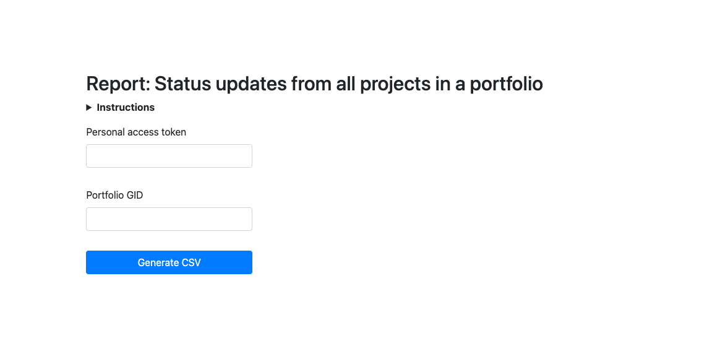
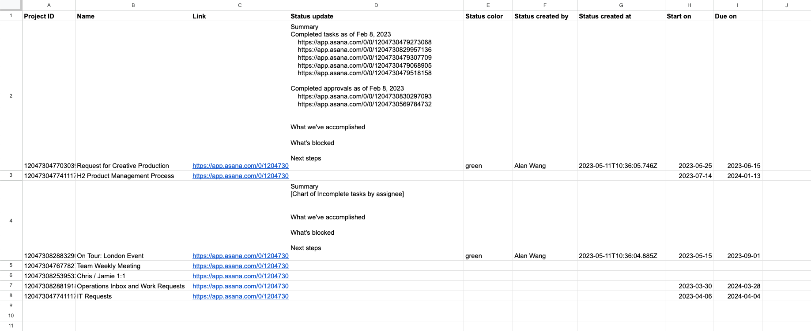

# Export Project Statuses to CSV
 
The Portfolio Status Updates application is used to extract [status updates](https://developers.asana.com/reference/status-updates) from [projects](https://developers.asana.com/reference/projects) in a nested [portfolio](https://developers.asana.com/reference/portfolios) structure in Asana. The resulting data is exported in CSV format.

➡️ [View the documentation](https://developers.asana.com/docs/export-project-statuses-to-csv) for this application, which includes a step-by-step tutorial.

## Requirements

Since the script largely makes use of out-of-the-box [DOM](https://developer.mozilla.org/en-US/docs/Web/API/Document_Object_Model) methods in the browser, there are no system requirements for this script. For requests to API endpoints the official [node-asana](https://github.com/Asana/node-asana) library is used.

Otherwise, ensure that you have the latest version of your preferred browser installed on your local machine.

## Usage

The user interface for this application is `./index.html`, a basic web page that embeds the client-side script: `./index.js`.

Before you begin, be sure to obtain a [personal access token](https://developers.asana.com/docs/personal-access-token) (PAT). This personal access token is how the script authenticates with Asana to request data via the Asana API. Upon successful authentication, the script parses and formats that data into a single CSV file.

Then, to get started, open `./index.html` in your browser and provide your personal access token and a portfolio GID in the input fields. Additional operating instructions are included on the page itself.

## Output

The standard information outputted in the resulting CSV file include the following project metadata:

* Project ID (`gid`)
* Project name (`name`)
* Project link
* Project start date (`start_on`)
* Project due date (`due_on`)
* Current status update (`current_status_update.text`)
* Current status update color (interpreted from `current_status_update.status_type`)
* Current status update author (`current_status_update.created_by.name`)
* Current status update creation time (`current_status_update.created_at`)

To get more information on a single project, you can request the complete project record by using its GID with the Asana API, as documented here: [GET /projects/{project_gid}](https://developers.asana.com/reference/getproject).

You may also customize the response you receive when requesting items from a portfolio (i.e., [GET /portfolios/{portfolio_gid}](https://developers.asana.com/reference/getitemsforportfolio)). See the documentation for [input/output options](https://developers.asana.com/docs/inputoutput-options) for details.