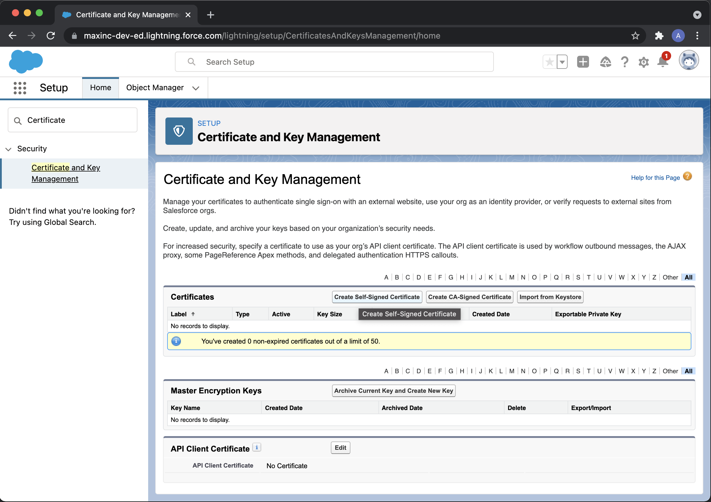
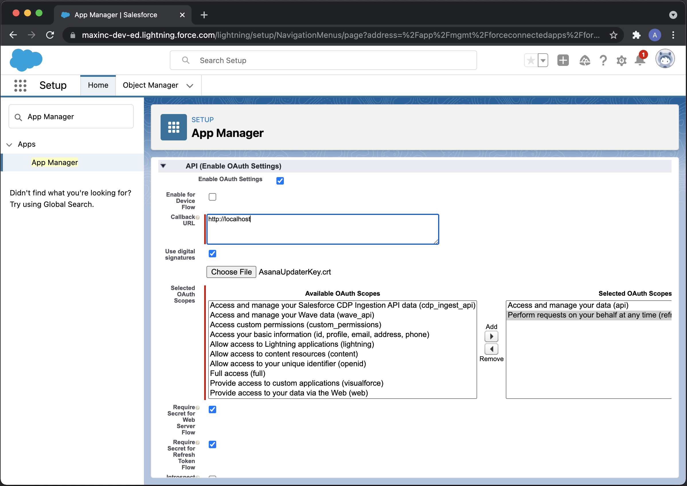
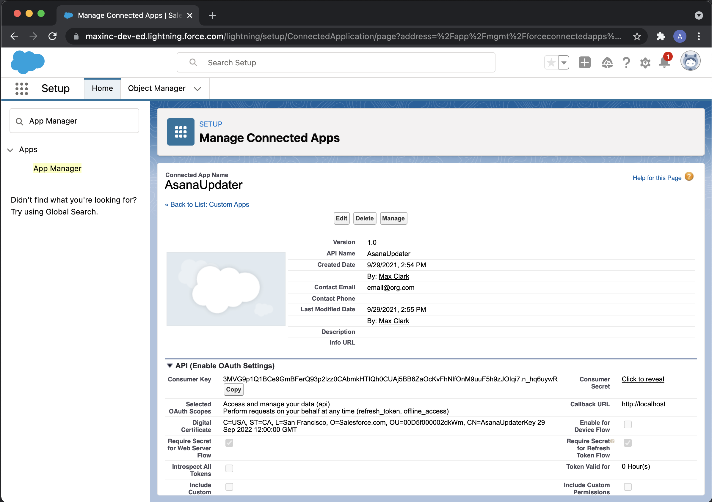
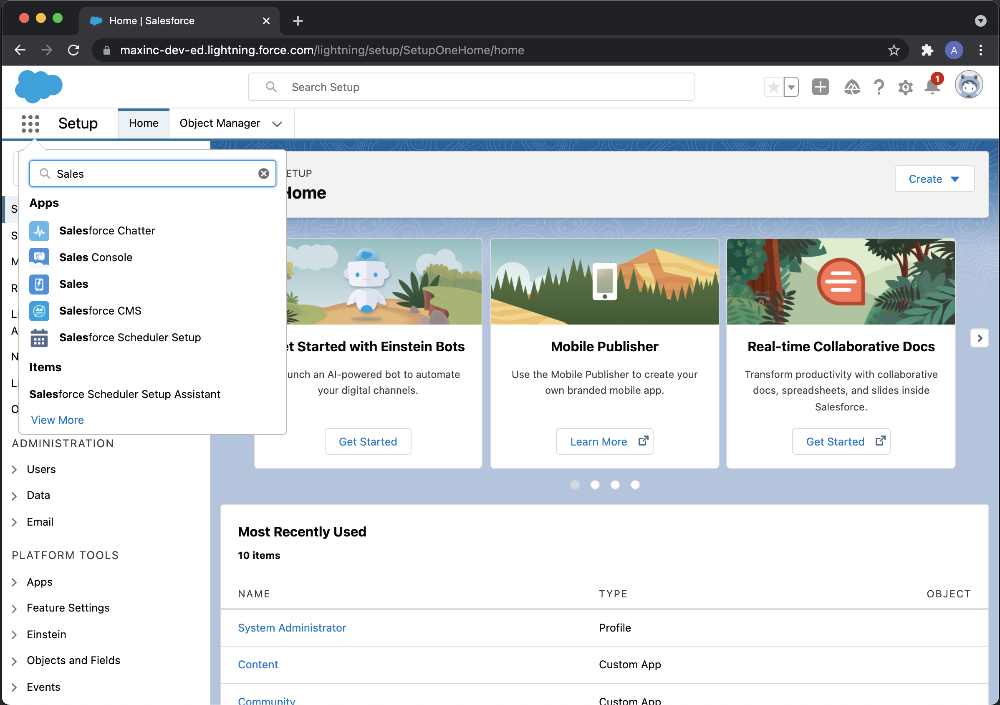

# Asana Goals Demo
This Python project showcases the Asana Goal APIs by fetching data from a SalesForce instance. 

## Overview

The Asana Goals API provides functionality to integrate Asana Goals with the other tools that you use to manage your work, enabling you to have a holistic view of data in a single place and automate progress updates on goals.

For example, some goals may aim to impact sales for an organization. With the Goals API, you can connect reports in Salesforce to Goals metrics in Asana, so that teams always have visibility into how their work has an impact.

In another example, you may want to create an automated and custom calculation that rolls up progress from sub-goals into the parent goal. With the Goals API, you can implement your custom formula by gathering metric data, calculating, and updating the appropriate goal.

To provide inspiration, we have created a project (available in Python) that demonstrates how you can build your own integration. The project showcases two use-cases: (1) syncing data from a Salesforce report to an Asana goal metric and (2) implementing custom roll-up calculations from sub-goals into a parent goal.

### Project disclaimer

The sample code in this project is provided as-is and serves only as an example for getting started. Please refer to our [documentation](https://developers.asana.com/docs) for additional information on building apps and tools on the Asana API to assist in your code development, testing and deployment.

### Project structure

The Goals API sample code demo project has two demonstrations within it that are detailed below. Prior to running the demo, you can run a script that will automatically create sample Goals within your Asana development sandbox and relevant environment variables for you to fill in.

As metrics are set for goals and sub-goals, the example project will also assist in automatically setting progress to ‘On Track’, ‘At Risk’, or ‘Off Track’ based on how close the metric is to the target.

#### Example 1: Connecting an Asana Goal to an external app

In this example, a Salesforce instance serves as our external data point that a Goal may aim to influence. For example, a team may want to achieve $100 million in revenue over a quarter, and connecting to Salesforce will give that real time number in Asana.

The demo connects the two apps and as you update opportunities in Salesforce, this demo project will automatically pull that data from Salesforce and update the Goal metrics and progress in Asana.

#### Example 2: Building a custom goal metric roll-up

In this example, we explore how teams can develop their own custom and automated rollups. The demo creates an example goal and sub-goals. The sub-goals are based on percentages, numbers and currency metrics. 

The demo shows how we can automate roll up calculating the percentage progress across all sub-goals and weighting them in order to calculate the overall percentage for the parent goal. 

## Getting Started
After you have cloned this project, there are three core steps to get the demo project running:

1. Obtain an Asana Developer Sandbox
3. Set up the project environment and tokens
4. Run the python project

### Obtain an Asana Developer Sandbox

To request your own development space, please visit the [Developer Sandbox](https://developers.asana.com/docs/developer-sandbox) section of our documentation.

### Set up the project envrionment and tokens

To set up environments for the demo, you will need to first initialize sample goal data in your Asana developer sandbox, then create a Salesforce developer sandbox for part of the demo.

#### Initialize Asana sample goal data

1. In your Asana sandbox, enter the Asana admin console and create a new service account and copy the generated access token.

2. Run the following application while providing your access token as a command line argument:

```
(venv) $ python -m asana_goals -i "MY_ACCESS_TOKEN"
```

3. This will return a list of workspaces available. Copy the desired workspace GID. Next, run the following with the desired workspace:

```
(venv) $ python -m asana_goals -i "MY_ACCESS_TOKEN" -w "WORKSPACE_GID"
```

4. This will return a list of time periods. Choose your desired time period and run the application one last time:

```
(venv) $ python -m asana_goals -i "MY_ACCESS_TOKEN" -w "WORKSPACE_GID" -t "TIME_PERIOD_ID"
```

At this point, several example goals will have been created in your Asana workspace. In addition, A default config file for the demo project titled, config.toml, is created in the current working directory. This configuration file contains the ID’s of the goals that we will interact with in the demo.

#### Create a Salesforce developer sandbox:

Note: there are a number of steps to set up the Salesforce side and these steps are to set up certificates so the demo project has authenticated access.

1. Get a Salesforce developer environment [here](https://developer.salesforce.com/signup). Save your username in the project config.toml file in the username entry. 

2. Next, enter the Setup menu by clicking the wheel icon to the top right of the Salesforce environment.


3. Use the search bar in the Setup menu on the left side to look for "Certificate and Key Management”.

4. Create a self-signed certificate. This is what we will use to access the Salesforce REST API.

5. Export to a keystore from the certificate management page by clicking “Export to Keystore”. Set any convenient passphrase and download the private key. The key is sent in a Java keystore format, with a filename `<FILENAME>.jks`



6. Convert this keystore to a PEM format private key run the following commands using the same passphrase you set on the "Export to Keystore" screen. 

```
$ keytool -importkeystore -srckeystore <FILENAME>.jks -destkeystore keys.p12 -deststoretype PKCS12
$ openssl pkcs12 -in keys.p12 -nodes -nocerts -out key.pem
```

7. If you have not edited this console command, copy the `key.pem` file to the project directory and set the `private_key_file` entry in config.toml to key.pem.

8. Set the certificate as API client certificate for your organization. On the lower side section "API Client Certificate" click "Edit" and set your new self-signed as client certificate.


9. Next, on the left-side navigation in Asana, search to look for "App Management" and create a new connected application with the top-right option "New Connected App".

10. Set any convenient name for the application, and make sure to enable OAuth. Use any placeholder callback URL as this will not be used. 

11. Tick the "Use digital signatures" option and upload the self-signed certificate `<FILENAME.crt>` you previously downloaded. Enable the following OAuth scopes:

```
Full access
Access and manage your data 
```



12. Go back to the App Manager and your new App should be there. Now click on the menu next to it, and select the "Manage" option.

13. Click the "Edit policies" button and scroll to the OAuth policies section. Set Permitted Users to "Admin approved users are pre-authorized" and set IP relaxation to "Relax IP restrictions" to avoid access issues.


14. Next, back in the App Manager, click the "View" option on your app. Your consumer key should be visible here. Copy it and paste it in the client_id entry in your `config.toml` file.



15. Next search for "Users" in the left-side setup menu and open the view. Your user should be visible and have the profile "System Administrator". 

16. Click the profile name and then click "Edit". In the "Connected App Access" section tick your app to enable it.

17. With this done you now have access to the Salesforce REST API!

18. Lastly, let’s set up the data that will be brought into Asana. To get data from this instance you need to either create a report, or install [this unmanaged package](https://login.salesforce.com/packaging/installPackage.apexp?p0=04t5f000000QLiN) that will create the report for you:

19. Replace "login.salesforce.com" with your developer org URL, which usually has the format "name-dev-ed.lightning.force.com". This will yield a page that allows to install the package for all users.


20. Now open the app launcher, which is the square tiles menu on the upper-left side, and enter the "Sales" app. 

22. Here, navigate to the "Report" tab, which is on the "More" menu if not on screen and click "All Reports" on the left-side menu to view all reports. There should be one named "Won opportunities". Open it and the report ID will be visible in the URL.




23. Set this report ID on the key `sf_report_id` in the `[goals.example_1]` section.

### Run the Python project

Now that your environment is set up, let’s run the demo!  

To run this application once, execute the following in your shell:

```
(venv) $ python -m asana_goals
```
To run it as a long polling service instead, execute the following. This will run the demo every 1 minute.

```
(venv) $ python -m asana_goals -s
```

### Next steps for your integration

You’ve set up the demo project - great work! To learn more about how you can take your integration forward and develop, host, and maintain it, please see [Custom Apps](https://developers.asana.com/docs/custom-apps) in our documentation for more information.