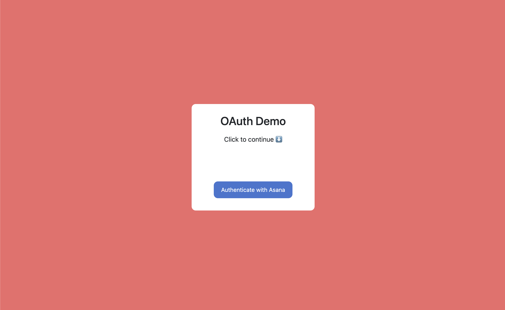
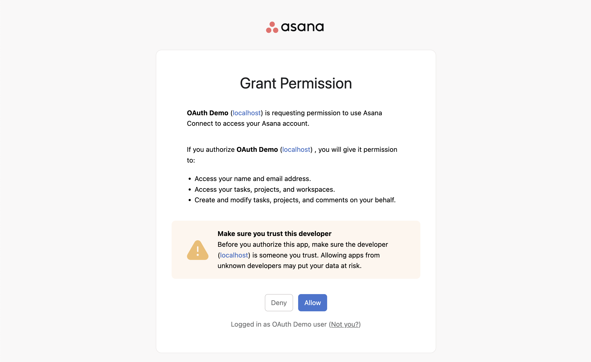
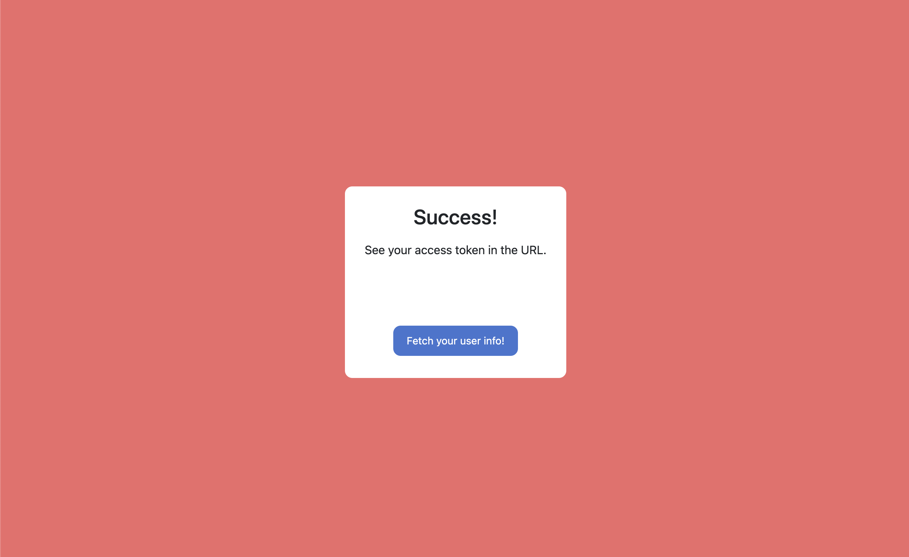

# OAuth Demo

The OAuth Demo is an application that demonstrates authorization with a user's Asana account via a basic OAuth server (built with [Flask](https://flask.palletsprojects.com/en/stable/)). The application shows how you might send a user through the [user authorization endpoint](https://developers.asana.com/docs/oauth#user-authorization-endpoint), as well as how a `code` can be exchanged for a token via the [token exchange endpoint](https://developers.asana.com/docs/oauth#token-exchange-endpoint).

_Note: This OAuth server should only be used for testing and learning purposes._

Documentation: Asana's [OAuth](https://developers.asana.com/docs/oauth)

## Requirements
The application was built with Python 3.9.0.

Visit Python's [official website](https://www.python.org/) to get the latest version for your local machine.

### Dependencies:
- [Flask](https://flask.palletsprojects.com/en/stable/)
- [Requests](https://pypi.org/project/requests/)
- [python-dotenv](https://pypi.org/project/python-dotenv/)
- [Asana Python library](https://pypi.org/project/asana/)

## Installation

After cloning this project, navigate to the root directory and install dependencies:

```
pip install -r requirements.txt
```

## Usage

1. [Create an application](https://developers.asana.com/docs/oauth#register-an-application). Take note of your **client ID** and **client secret**, and set the **redirect URI** to `http://localhost:3000/oauth-callback`. 

_Note: In order for a user to be able to authorize via the [user authorization endpoint](https://developers.asana.com/docs/oauth#user-authorization-endpoint), the application must be available in the user's workspace. See the [manage distribution](https://developers.asana.com/docs/manage-distribution) documentation for details._ 

2. Create a `./.env` file (in the root directory of the project) with the required configurations:

```
CLIENT_ID=your_client_id_here
CLIENT_SECRET=your_client_secret_here
REDIRECT_URI=your_redirect_uri_here
```

You can view an example in the included `./.env-example` file. Note that you should _never_ commit or otherwise expose your `./.env` file publicly.

3. Start the server:

```
python app.py
```

This will start the Flask application on `http://localhost:3000`.

4. Visit [http://localhost:3000](http://localhost:3000) and click on "Authenticate with Asana"



5. Select "Allow" to grant the application access to your Asana account



You may also wish to view helpful outputs and notes in your terminal as well.

6. After successful authentication, you will be notified and redirected by the application.



Your access token (with an expiration of one hour) will also be loaded into the URL as a query parameter. With the access token, you can:

* Select "Fetch your user info!" to have the application make a request to [GET /users/me](https://developers.asana.com/reference/getuser) on your behalf (and output the response as JSON in the browser)
* Use the access token to make an API request yourself (e.g., via the [API Explorer](https://developers.asana.com/docs/api-explorer), [Postman Collection](https://developers.asana.com/docs/postman-collection), etc.)

## Deauthorizing the demo app

To remove the app from your list of Authorized Apps:

1. Click on your profile photo in the top right corner of the [Asana app](https://app.asana.com)
2. Select "My Settings"
3. Select the "App" tab
4. Select "Deauthorize" next to your application's name

Once deauthorized, you must begin the OAuth process again to authenticate with Asana.

## Additional notes

* This OAuth demo server is built with Python and Flask. The server allows a user to authenticate via Asana, exchange the authorization code for an access token, and fetch user data from Asana.
* The Flask application stores session data (such as the OAuth state and tokens) using Flask's secure session system, protected by a secret key. This key is generated using `os.urandom(24)` and should never be exposed.