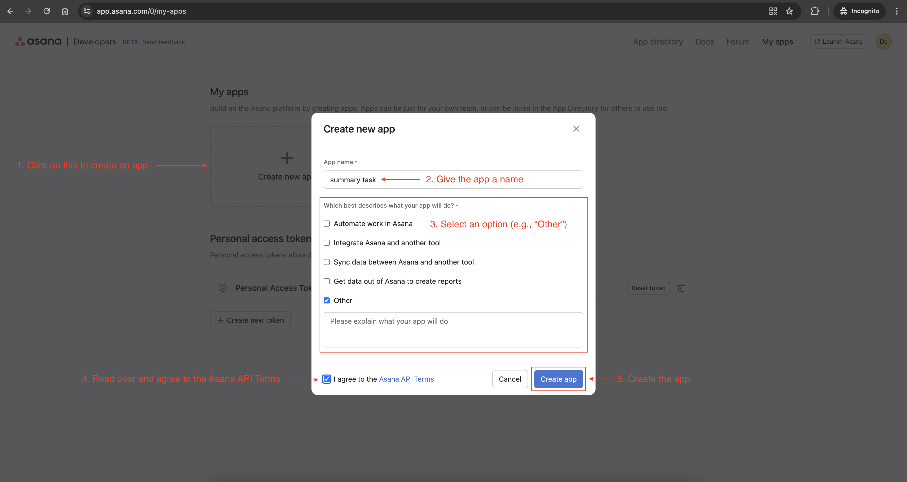
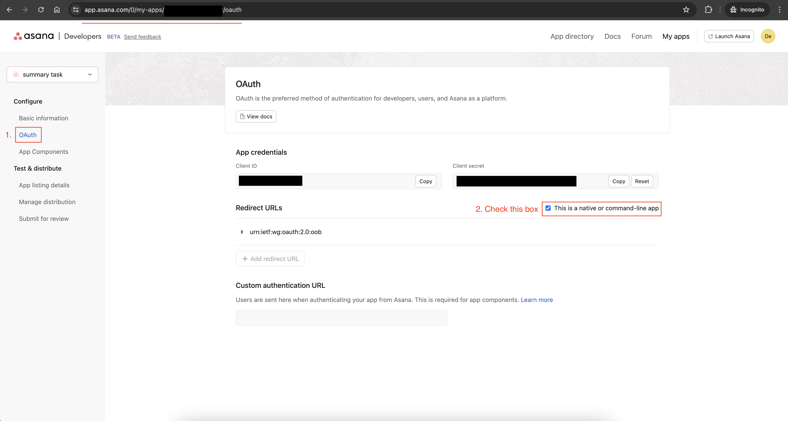
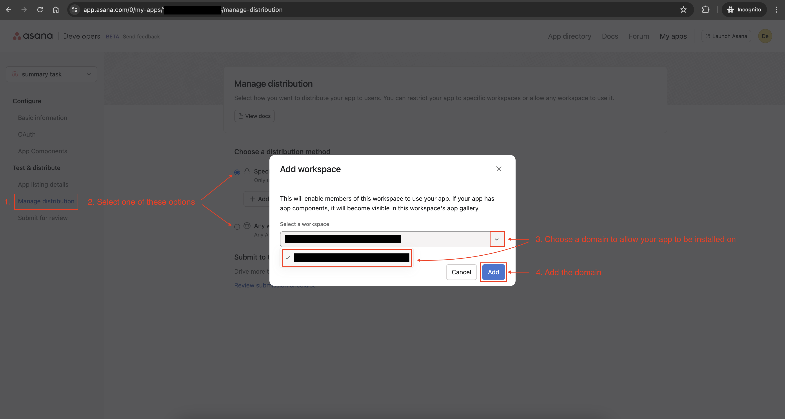
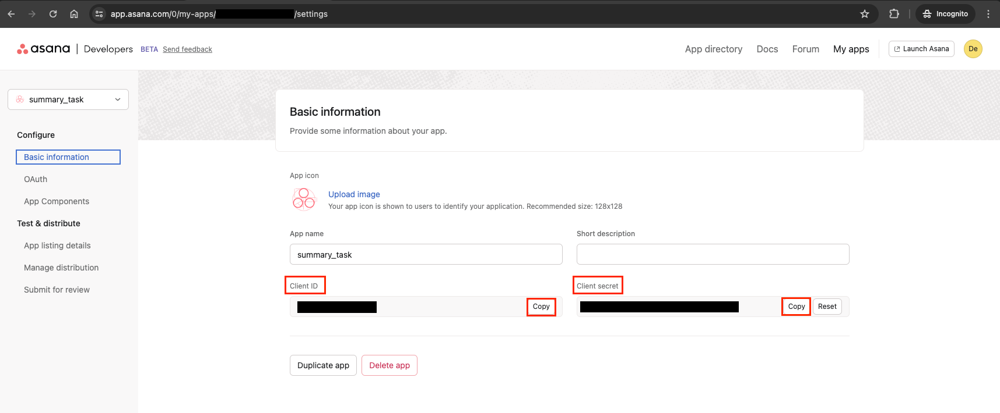
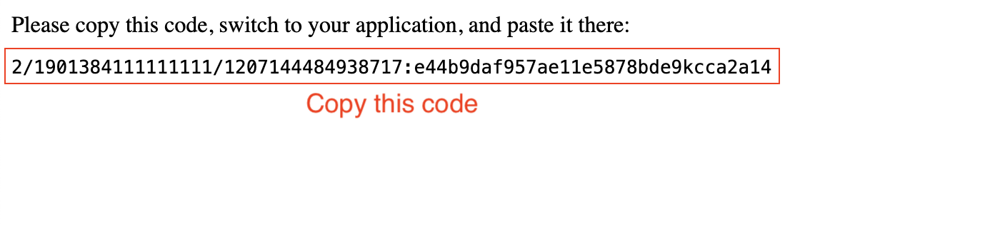
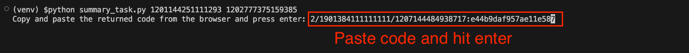

# Summary Task
This is an example of retrieving tasks from a project and creating a task.

For each `project_id`, the script will create a "summary" task in the 
`summary_project_id` containing aggregate data about the summary. 
This data includes:
  * Project
    * Last modified time
  * All tasks
    * Number of tasks
    * Number of tasks completed
  * Incomplete tasks
    * Number of incomplete tasks
    * Number of incomplete tasks unassigned
    * Number of incomplete tasks overdue
  * Custom Fields
    * Enum field
      * Number of tasks in each enum option
      * Number of tasks with no selected option
    * Multi-Enum field
      * Number of tasks with each enum option
      * Number of tasks with no selected option
    * Date
      * Number of tasks with date field filled in
      * Number of tasks with date field not filled in
    * People
      * Number of tasks with people field filled in
      * Number of tasks with people field not filled in
    * Text field
      * Number of tasks with text field filled in
      * Number of tasks with text field not filled in
    * Number field
      * Number of tasks with field filled in
      * Total sum of numbers
      * Average of numbers
    * Formula field
      * Number of tasks with field filled in

## Setup

### 1: Install dependencies

OPTION 1: Install dependencies via Pipfile

```
pipenv install 
```

OPTION 2: Install manually
```
pip install "asana~=5.0.6" "requests-oauthlib~=2.0.0"
```

### 2: Create and Configure Asana App

1. Navigate to the [Asana Developer Console](https://app.asana.com/0/my-apps) and create an application


2. Navigate to the **"OAuth"** page from your app settings page and check the **"This is a native or command-line app"** checkbox


3. Navigate to the **"Manage distribution"** page from your app settings page and choose a distribution method. **NOTE:** if you choose the **"Specific workspaces"** option, make sure that you select the workspace you plan on running this script on.


### 3: Set up environment variables

Navigate to the [Asana Developer Console](https://app.asana.com/0/my-apps) and select your application. Copy the `Client ID` and `Client secret` and set them as environment variables in your shell.



```
export ASANA_CLIENT_ID=<YOUR_ASANA_APP_CLIENT_ID>
```
```
export ASANA_CLIENT_SECRET=<YOUR_ASANA_APP_CLIENT_SECRET>
```


## Usage

```
usage: summary_task.py [-h] summary_project_id project_id [project_id ...]

positional arguments:
  summary_project_id  project id of project to post summary task to
  project_id          project id of project to summarize

optional arguments:
  -h, --help          show this help message and exit
```

### Steps:

1. Run the script. EX: `python summary_task.py 1201144251111293 1202777375159385`
2. If this is your first time running the script, the script will take you to the Asana **"Grant Permission"** page where you need to click on the **"Allow"** button to authorize the app.
3. You will be presented with a page with a code. Copy this code.

4. Paste the code into your running application and hit enter on your keyboard

5. Check your summary project (e.g., from our example run, this is project: `1201144251111293`) and see the summary task(s) that was created
